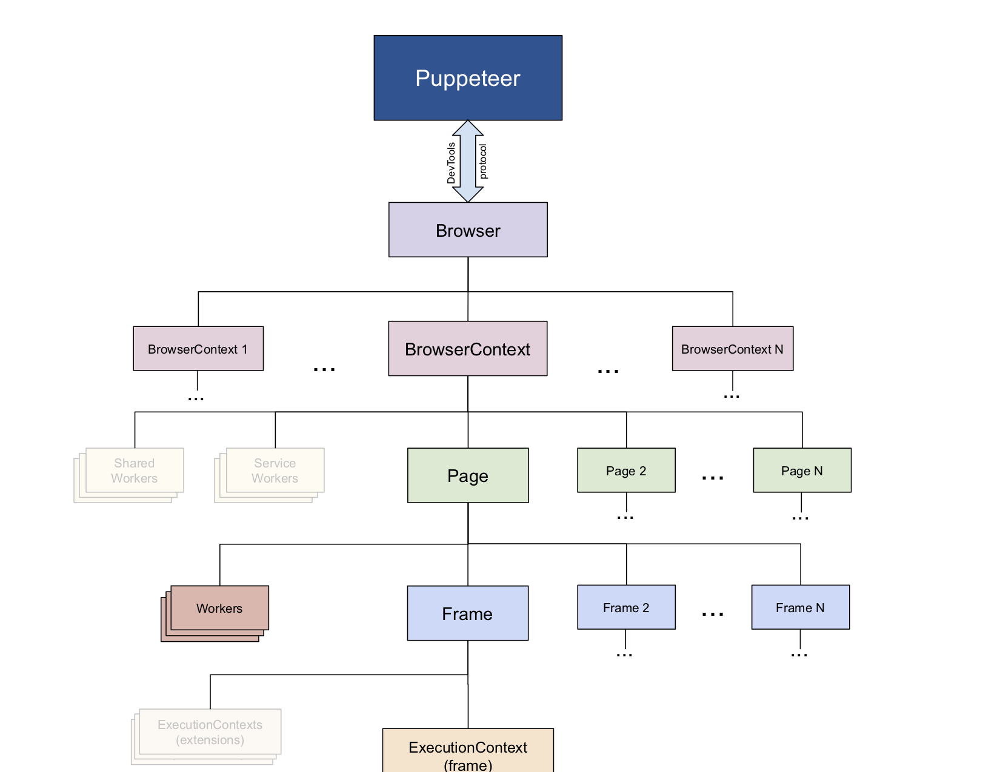

# puppeteer-notes
puppeteer notes

## 安装

GitHub: https://github.com/puppeteer/puppeteer

```bash
npm i puppeteer

# or

yarn add puppeteer
```

*puppeteer-core*

Since version 1.7.0 we publish the puppeteer-core package, a version of Puppeteer that doesn't download any browser by default.

```bash
npm i puppeteer-core
# or

yarn add puppeteer-core
```

*Usage with TypeScript*

```bash
npm install --save-dev @types/puppeteer
```


## 简介

- Puppeteer communicates with the browser using DevTools Protocol.
- Browser instance can own multiple browser contexts.
- BrowserContext instance defines a browsing session and can own multiple pages.
- Page has at least one frame: main frame. There might be other frames created by iframe or frame tags.
- Frame has at least one execution context - the default execution context - where the frame's - JavaScript is executed. A Frame might have additional execution contexts that are associated with extensions.
- Worker has a single execution context and facilitates interacting with WebWorkers.



## demo

- demo/simple.js
